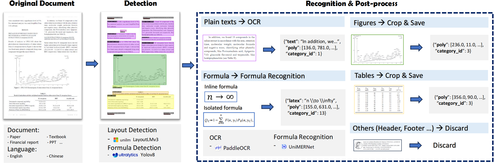

<p align="center">
  
</p>


<div align="center">

[English](./README.md) | 简体中文

[[Models (🤗Hugging Face)]](https://huggingface.co/wanderkid/PDF-Extract-Kit) | [[Models(ModelScope)]](https://www.modelscope.cn/models/wanderkid/PDF-Extract-Kit) 
 

🔥🔥🔥 [MinerU：基于PDF-Extract-Kit的高效文档内容提取工具](https://github.com/opendatalab/MinerU)

</div>

<p align="center">
    👋 join us on <a href="https://discord.gg/JYsXDXXN" target="_blank">Discord</a> and <a href="https://r.vansin.top/?r=MinerU" target="_blank">WeChat</a>
</p>


## 整体介绍

PDF文档中包含大量知识信息，然而提取高质量的PDF内容并非易事。为此，我们将PDF内容提取工作进行拆解：
- 布局检测：使用[LayoutLMv3](https://github.com/microsoft/unilm/tree/master/layoutlmv3)模型进行区域检测，如`图像`，`表格`,`标题`,`文本`等；
- 公式检测：使用[YOLOv8](https://github.com/ultralytics/ultralytics)进行公式检测，包含`行内公式`和`行间公式`；
- 公式识别：使用[UniMERNet](https://github.com/opendatalab/UniMERNet)进行公式识别；
- 表格识别：使用[StructEqTable](https://github.com/UniModal4Reasoning/StructEqTable-Deploy)进行表格识别；
- 光学字符识别：使用[PaddleOCR](https://github.com/PaddlePaddle/PaddleOCR)进行文本识别；

> **注意：** *由于文档类型的多样性，现有开源的布局检测和公式检测很难处理多样性的PDF文档，为此我们内容采集多样性数据进行标注和训练，使得在各类文档上取得精准的检测效果，细节参考[布局检测](#layout-anchor)和[公式检测](#mfd-anchor)部分。对于公式识别，UniMERNet方法可以媲美商业软件，在各种类型公式识别上均匀很高的质量。对于OCR，我们采用PaddleOCR，对中英文OCR效果不错。*

PDF内容提取框架如下图所示




## 新闻和更新
- `2024.08.01` 🎉🎉🎉 新增了[StructEqTable](demo/TabRec/StructEqTable/README_TABLE.md)表格识别模块用于表格内容提取，欢迎使用！
- `2024.07.01` 🎉🎉🎉 我们发布了`PDF-Extract-Kit`，一个用于高质量PDF内容提取的综合工具包，包括`布局检测`、`公式检测`、`公式识别`和`OCR`。
```


<details>
  <summary>PDF-Extract-Kit输出格式</summary>

```Bash
{
    "layout_dets": [    # 页中的元素
        {
            "category_id": 0, # 类别编号， 0~9，13~15
            "poly": [
                136.0, # 坐标为图片坐标，需要转换回pdf坐标, 顺序是 左上-右上-右下-左下的x,y坐标
                781.0,
                340.0,
                781.0,
                340.0,
                806.0,
                136.0,
                806.0
            ],
            "score": 0.69,   # 置信度
            "latex": ''      # 公式识别的结果，只有13,14有内容，其他为空，另外15是ocr的结果，这个key会换成text
        },
        ...
    ],
    "page_info": {         # 页信息：提取bbox时的分辨率大小，如果有缩放可以基于该信息进行对齐
        "page_no": 0,      # 页数
        "height": 1684,    # 页高
        "width": 1200      # 页宽
    }
}
```

其中category_id包含的类型如下：

```
{0: 'title',              # 标题
 1: 'plain text',         # 文本
 2: 'abandon',            # 包括页眉页脚页码和页面注释
 3: 'figure',             # 图片
 4: 'figure_caption',     # 图片描述
 5: 'table',              # 表格
 6: 'table_caption',      # 表格描述
 7: 'table_footnote',     # 表格注释
 8: 'isolate_formula',    # 行间公式（这个是layout的行间公式，优先级低于14）
 9: 'formula_caption',    # 行间公式的标号

 13: 'inline_formula',    # 行内公式
 14: 'isolated_formula',  # 行间公式
 15: 'ocr_text'}              # ocr识别结果
```
</details>


## 效果展示

结合多样性PDF文档标注，我们训练了鲁棒的`布局检测`和`公式检测`模型。在论文、教材、研报、财报等多样性的PDF文档上，我们的pipeline都能得到准确的提取结果，对于扫描模糊、水印等情况也有较高鲁棒性。


## 评测指标

现有开源模型多基于Arxiv论文类型数据进行训练，面对多样性的PDF文档，提取质量远不能达到实用需求。相比之下，我们的模型经过多样化数据训练，可以适应各种类型文档提取。

评测代码及详细信息请看[这里](./assets/validation/README-zh_CN.md)。

<span id="layout-anchor"></span>
### 布局检测

我们与现有的开源Layout检测模型做了对比，包括[DocXchain](https://github.com/AlibabaResearch/AdvancedLiterateMachinery/tree/main/Applications/DocXChain)、[Surya](https://github.com/VikParuchuri/surya)、[360LayoutAnalysis](https://github.com/360AILAB-NLP/360LayoutAnalysis)的两个模型。而LayoutLMv3-SFT指的是我们在[LayoutLMv3-base-chinese预训练权重](https://huggingface.co/microsoft/layoutlmv3-base-chinese)的基础上进一步做了SFT训练后的模型。论文验证集由402张论文页面构成，教材验证集由587张不同来源的教材页面构成。

<table>
    <tr>
        <th align="center" rowspan="2">模型</th> 
        <th colspan="3" align="center">论文验证集</th> 
        <th colspan="3" align="center">教材验证集</th> 
   </tr>
    <tr>
      	 <th>mAP</th>
         <th>AP50</th>
         <th>AR50</th>
         <th>mAP</th>
         <th>AP50</th>
         <th>AR50</th>    
    </tr>
    <tr>
        <td>DocXchain</td>
        <td>52.8</td>
        <td>69.5</td>
        <td>77.3</td> 
        <td>34.9</td>
        <td>50.1</td>
        <td>63.5</td>   
    </tr>
    <tr>
        <td>Surya</td>
        <td>24.2</td>
        <td>39.4</td>
        <td>66.1</td> 
        <td>13.9</td>
        <td>23.3</td>
        <td>49.9</td>   
    </tr>
    <tr>
        <td>360LayoutAnalysis-Paper</td>
        <td>37.7</td>
        <td>53.6</td>
        <td>59.8</td> 
        <td>20.7</td>
        <td>31.3</td>
        <td>43.6</td>   
    </tr>
    <tr>
        <td>360LayoutAnalysis-Report</td>
        <td>35.1</td>
        <td>46.9</td>
        <td>55.9</td> 
        <td>25.4</td>
        <td>33.7</td>
        <td>45.1</td>   
    </tr>
    <tr>
        <td bgcolor="#f0f0f0">LayoutLMv3-SFT</td>
        <th bgcolor="#f0f0f0">77.6</th>
        <th bgcolor="#f0f0f0">93.3</th>
        <th bgcolor="#f0f0f0">95.5</th> 
        <th bgcolor="#f0f0f0">67.9</th>
        <th bgcolor="#f0f0f0">82.7</th>
        <th bgcolor="#f0f0f0">87.9</th>   
    </tr>
</table>


<span id="mfd-anchor"></span>
### 公式检测

我们与开源的模型[Pix2Text-MFD](https://github.com/breezedeus/pix2text)做了对比。另外，YOLOv8-Trained是我们在[YOLOv8l](https://github.com/ultralytics/)模型的基础上训练后的权重。论文验证集由255张论文页面构成，多源验证集由789张不同来源的页面构成，包括教材、书籍等。

<table>
    <tr>
        <th align="center" rowspan="2">模型</th> 
        <th colspan="2" align="center">论文验证集</th> 
        <th colspan="2" align="center">多源验证集</th> 
   </tr>
    <tr>
         <th>AP50</th>
         <th>AR50</th>
         <th>AP50</th>
         <th>AR50</th>    
    </tr>
    <tr>
        <td>Pix2Text-MFD</td>
        <td>60.1</td> 
        <td>64.6</td>
        <td>58.9</td>
        <td>62.8</td>   
    </tr>
    <tr>
        <td bgcolor="#f0f0f0">YOLOv8-Trained</td>
        <th bgcolor="#f0f0f0">87.7</th> 
        <th bgcolor="#f0f0f0">89.9</th>
        <th bgcolor="#f0f0f0">82.4</th>
        <th bgcolor="#f0f0f0">87.3</th>   
    </tr>
</table>

### 公式识别


公式识别我们使用的是[UniMERNet](https://github.com/opendatalab/UniMERNet)的权重，没有进一步的SFT训练，其精度验证结果可以在其GitHub页面获取。

### 表格识别


表格识别我们使用的是[StructEqTable](https://github.com/UniModal4Reasoning/StructEqTable-Deploy)的权重，用于将表格转换为LaTeX。相比于PP-StructureV2的表格识别，StructEqTable的识别能力更强，针对复杂表格也能够有不错的效果，但目前可能主要适用于学术论文中的数据，速度也有较大的提升空间，我们仍在不断迭代优化中。在一周内我们会将表格识别的功能同步更新到[MinerU](https://github.com/opendatalab/MinerU)中。

## 使用教程

### 环境安装 (Linux)

```bash
conda create -n pipeline python=3.10

pip install -r requirements.txt

pip install --extra-index-url https://miropsota.github.io/torch_packages_builder detectron2==0.6+pt2.3.1cu121
```

安装完环境后，可能会遇到一些版本冲突导致版本变更，如果遇到了版本相关的报错，可以尝试下面的命令重新安装指定版本的库。

```bash
pip install pillow==8.4.0
```

除了版本冲突外，可能还会遇到torch无法调用的错误，可以先把下面的库卸载，然后重新安装cuda12和cudnn。

```bash
pip uninstall nvidia-cusparse-cu12
```

### 参考[模型下载](models/README.md)下载所需模型权重


## 在Windows上运行

如需要在Windows上运行本项目，请参考[在Windows环境下使用PDF-Extract-Kit](docs/Install_in_Windows_zh_cn.md)。


## 在macOS上运行

如需要在macOS上运行本项目，请参考[在macOS系统使用PDF-Extract-Kit](docs/Install_in_macOS_zh_cn.md)。


## 运行提取脚本

```bash 
python pdf_extract.py --pdf data/pdfs/ocr_1.pdf
```

相关参数解释：
- `--pdf` 待处理的pdf文件，如果传入一个文件夹，则会处理文件夹下的所有pdf文件。
- `--output` 处理结果保存的路径，默认是"output"
- `--vis` 是否对结果可视化，是则会把检测的结果可视化出来，主要是检测框和类别
- `--render` 是否把识别得的结果渲染出来，包括公式的latex代码，以及普通文本，都会渲染出来放在检测框中。注意：此过程非常耗时，另外也需要提前安装`xelatex`和`imagemagic`。

> 本项目专注使用模型对`多样性`文档进行`高质量`内容提取，不涉及提取后内容拼接成新文档，如PDF转Markdown。如果有此类需求，请参考我们另一个Github项目: [MinerU](https://github.com/opendatalab/MinerU)


## 待办事项

- [x] **表格解析**：开发能够将表格图像转换成对应的LaTeX/Markdown格式源码的功能。  
- [ ] **化学方程式检测**：实现对化学方程式的自动检测。  
- [ ] **化学方程式/图解识别**：开发识别并解析化学方程式的模型。  
- [ ] **阅读顺序排序模型**：构建模型以确定文档中文本的正确阅读顺序。  

**PDF-Extract-Kit** 旨在提供高质量PDF文件的提取能力。我们鼓励社区提出具体且有价值的需求，并欢迎大家共同参与，以不断改进PDF-Extract-Kit工具，推动科研及产业发展。


## 协议

本仓库的代码依照 [Apache-2.0](LICENSE) 协议开源。

使用模型权重时，请遵循对应的模型协议：[LayoutLMv3](https://github.com/microsoft/unilm/tree/master/layoutlmv3) / [UniMERNet](https://github.com/opendatalab/UniMERNet) / [StructEqTable](https://github.com/UniModal4Reasoning/StructEqTable-Deploy) / [YOLOv8](https://github.com/ultralytics/ultralytics) / [PaddleOCR](https://github.com/PaddlePaddle/PaddleOCR).


## 致谢

   - [LayoutLMv3](https://github.com/microsoft/unilm/tree/master/layoutlmv3): 布局检测模型
   - [UniMERNet](https://github.com/opendatalab/UniMERNet): 公式识别模型
   - [StructEqTable](https://github.com/UniModal4Reasoning/StructEqTable-Deploy): 表格识别模型
   - [YOLOv8](https://github.com/ultralytics/ultralytics): 公式检测模型
   - [PaddleOCR](https://github.com/PaddlePaddle/PaddleOCR): OCR模型


## Citation

如果你觉得我们模型/代码/技术报告对你有帮助，请给我们⭐和引用📝,谢谢 :)  
```bibtex
@misc{wang2024unimernet,
      title={UniMERNet: A Universal Network for Real-World Mathematical Expression Recognition}, 
      author={Bin Wang and Zhuangcheng Gu and Chao Xu and Bo Zhang and Botian Shi and Conghui He},
      year={2024},
      eprint={2404.15254},
      archivePrefix={arXiv},
      primaryClass={cs.CV}
}

@article{he2024opendatalab,
  title={Opendatalab: Empowering general artificial intelligence with open datasets},
  author={He, Conghui and Li, Wei and Jin, Zhenjiang and Xu, Chao and Wang, Bin and Lin, Dahua},
  journal={arXiv preprint arXiv:2407.13773},
  year={2024}
}
```


## Star历史

<a>
 <picture>
   <source media="(prefers-color-scheme: dark)" srcset="https://api.star-history.com/svg?repos=opendatalab/PDF-Extract-Kit&type=Date&theme=dark" />
   <source media="(prefers-color-scheme: light)" srcset="https://api.star-history.com/svg?repos=opendatalab/PDF-Extract-Kit&type=Date" />
   
 </picture>
</a>

## 友情链接
- [LabelU(轻量级多模态标注工具）](https://github.com/opendatalab/labelU)
- [LabelLLM（开源LLM对话标注平台）](https://github.com/opendatalab/LabelLLM)
- [Miner U（一站式高质量数据提取工具）](https://github.com/opendatalab/MinerU)
