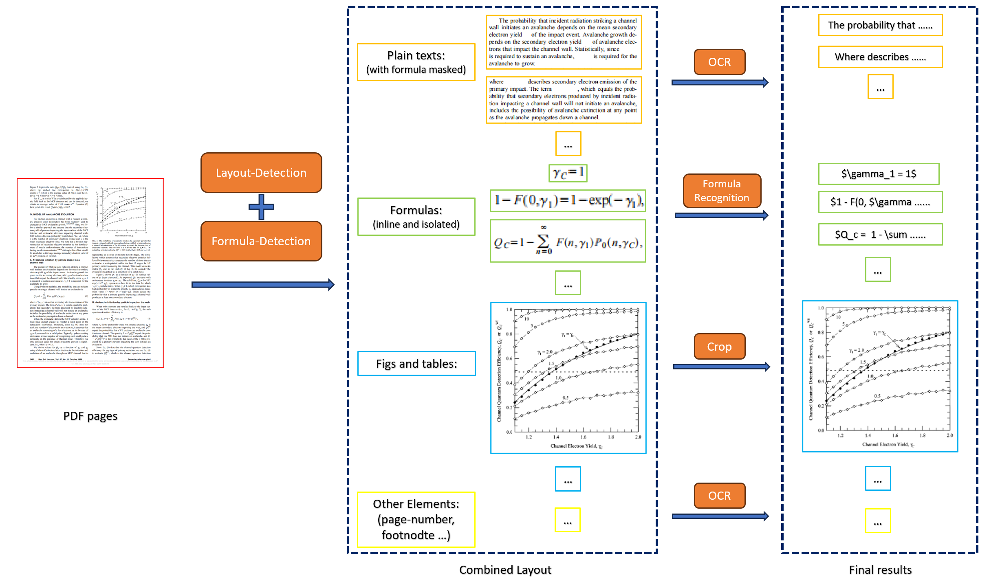

# PDF EXTRACT KIT
一款汇总了四种模型的PDF提取工具，提取结果全面且准确，使用到的模型如下：
- 布局检测：使用的Layoutlmv3
- 公式检测：使用的ultralytics/yolov8
- 公式识别：使用的UniMERNet
- 文本检测：使用的PaddleOCR

整体的提取框架如下图所示：




## 安装教程

1. 环境安装

```
conda create -n pipeline python=3.10

pip install unimernet

pip install -r requirements.txt

pip install --extra-index-url https://miropsota.github.io/torch_packages_builder detectron2==0.6+pt2.2.2cu121
```

安装完环境后，可能会遇到一些版本冲突导致版本变更，如果遇到了版本相关的报错，可以尝试下面的命令重新安装指定版本的库。

```
pip uninstall PyMuPDF

pip install PyMuPDF==1.20.2

pip install pillow==8.4.0
```

除了版本冲突外，可能还会遇到torch无法调用的错误，可以先把下面的库卸载，然后重新安装cuda12和cudnn。

```
pip uninstall nvidia-cusparse-cu12
```

2. 参考[教程](models/README.md)下载模型权重文件

## 使用方法


```bash 
python pdf_extract.py --pdf data/pdfs/ocr_1.pdf
```

相关参数解释：
- --pdf 待处理的pdf文件，如果传入一个文件夹，则会处理文件夹下的所有pdf文件。
- --output 处理结果保存的路径，默认是"output"
- --vis 是否对结果可视化，是则会把检测的结果可视化出来，主要是检测框和类别
- --render 是否把识别得的结果渲染出来，包括公式的latex代码，以及普通文本，都会渲染出来放在检测框中，这个非常耗时，另外也需要提前安装xelatex 和 imagemagic。


## 处理结果

pipelin处理结果的格式如下：

```Bash
{
    "layout_dets": [    # 页中的元素
        {
            "category_id": 0, # 类别编号， 0~9，13~15
            "poly": [
                136.0, # 坐标为图片坐标，需要转换回pdf坐标, 顺序是 左上-右上-右下-左下的x,y坐标
                781.0,
                340.0,
                781.0,
                340.0,
                806.0,
                136.0,
                806.0
            ],
            "score": 0.69,   # 置信度
            "latex": ''      # 公式识别的结果，只有13,14有内容，其他为空，另外15是ocr的结果，这个key会换成text
        },
        ...
    ],
    "page_info": {         # 页信息：提取bbox时的分辨率大小，如果有缩放可以基于该信息进行对齐
        "page_no": 0,      # 页数
        "height": 1684,    # 页高
        "width": 1200      # 页宽
    }
}
```

其中category_id包含的类型如下：

```
{0: 'title',              # 标题
 1: 'plain text',         # 文本
 2: 'abandon',            # 包括页眉页脚页码和页面注释
 3: 'figure',             # 图片
 4: 'figure_caption',     # 图片描述
 5: 'table',              # 表格
 6: 'table_caption',      # 表格描述
 7: 'table_footnote',     # 表格注释
 8: 'isolate_formula',    # 行间公式（这个是layout的行间公式，优先级低于14）
 9: 'formula_caption',    # 行间公式的标号

 13: 'inline_formula',    # 行内公式
 14: 'isolated_formula',  # 行间公式
 15: 'ocr_text'}              # ocr识别结果
```


## Acknowledgement

   - [LayoutLMv3](https://github.com/microsoft/unilm/tree/master/layoutlmv3)
   - [UniMERNet](https://github.com/opendatalab/UniMERNet)
   - [Ultralytics/yolov8](https://github.com/ultralytics/ultralytics)
   - [PaddleOCR](https://github.com/PaddlePaddle/PaddleOCR)