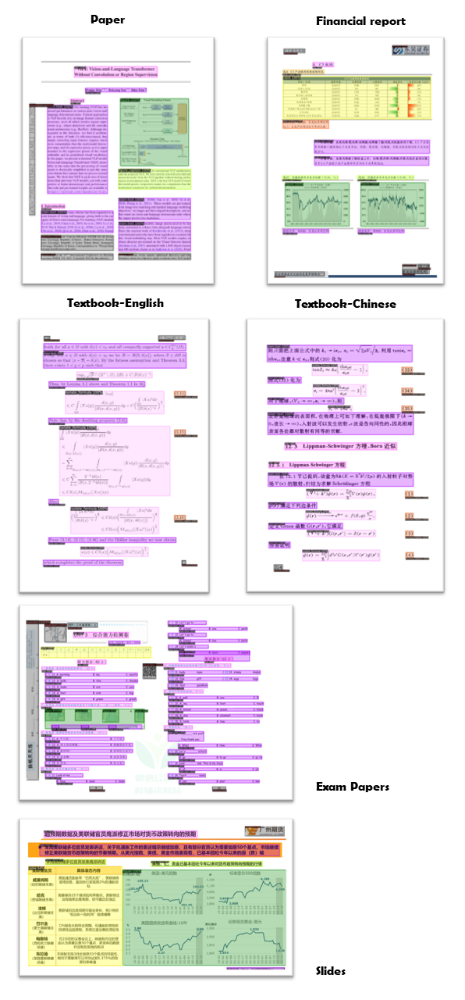

English | [简体中文](./README-zh_CN.md)

## Overview

PDF documents contain a wealth of knowledge, yet extracting high-quality content from PDFs is not an easy task. To address this, we have broken down the task of PDF content extraction into several components:
- **Layout Detection**: Using the [LayoutLMv3](https://github.com/microsoft/unilm/tree/master/layoutlmv3) model for region detection, such as `images`, `tables`, `titles`, `text`, etc.;
- **Formula Detection**: Using [YOLOv8](https://github.com/ultralytics/ultralytics) for detecting formulas, including `inline formulas` and `isolated formulas`;
- **Formula Recognition**: Using [UniMERNet](https://github.com/opendatalab/UniMERNet) for formula recognition;
- **Optical Character Recognition**: Using [PaddleOCR](https://github.com/PaddlePaddle/PaddleOCR) for text recognition;

> **Note:** *Due to the diversity of document types, existing open-source layout and formula detection models struggle with diverse PDF documents. Therefore, we have collected diverse data for annotation and training to achieve precise detection effects on various types of documents. For details, refer to the sections on [Layout Detection](#layout-anchor) and [Formula Detection](#mfd-anchor). For formula recognition, the UniMERNet method rivals commercial software in quality across various types of formulas. For OCR, we use PaddleOCR, which performs well for both Chinese and English.*

The PDF content extraction framework is illustrated below:


<details>
  <summary>PDF-Extract-Kit Output Format</summary>

```Bash
{
    "layout_dets": [    # Elements on the page
        {
            "category_id": 0, # Category ID, 0~9, 13~15
            "poly": [
                136.0, # Coordinates are in image format, need to convert back to PDF coordinates, order is top-left, top-right, bottom-right, bottom-left x,y coordinates
                781.0,
                340.0,
                781.0,
                340.0,
                806.0,
                136.0,
                806.0
            ],
            "score": 0.69,   # Confidence score
            "latex": ''      # Formula recognition result, only categories 13, 14 have content, others are empty, additionally 15 is the OCR result, this key will be replaced with text
        },
        ...
    ],
    "page_info": {         # Page information: resolution size when extracting bounding boxes, alignment can be based on this information if scaling is involved
        "page_no": 0,      # Page number
        "height": 1684,    # Page height
        "width": 1200      # Page width
    }
}
```

The types included in `category_id` are as follows:

```
{0: 'title',              # Title
 1: 'plain text',         # Text
 2: 'abandon',            # Includes headers, footers, page numbers, and page annotations
 3: 'figure',             # Image
 4: 'figure_caption',     # Image caption
 5: 'table',              # Table
 6: 'table_caption',      # Table caption
 7: 'table_footnote',     # Table footnote
 8: 'isolate_formula',    # Display formula (this is a layout display formula, lower priority than 14)
 9: 'formula_caption',    # Display formula label

 13: 'inline_formula',    # Inline formula
 14: 'isolated_formula',  # Display formula
 15: 'ocr_text'}          # OCR result
```
</details>


## Visualization of Results

By annotating a variety of PDF documents, we have trained robust models for `layout detection` and `formula detection`. Our pipeline achieves accurate extraction results on diverse types of PDF documents such as academic papers, textbooks, research reports, and financial statements, and is highly robust even in cases of scanned blurriness or watermarks.




## Evaluation Metrics

Existing open-source models are often trained on data from Arxiv papers and fall short when facing diverse PDF documents. In contrast, our models, trained on diverse data, are capable of adapting to various document types for extraction.

<span id="layout-anchor"></span>
### Layout Detection
TODO

<span id="mfd-anchor"></span>
### Formula Detection
TODO

### Formula Recognition

## Installation Guide

```bash
conda create -n pipeline python=3.10

pip install unimernet

pip install -r requirements.txt

pip install --extra-index-url https://miropsota.github.io/torch_packages_builder detectron2==0.6+pt2.2.2cu121
```

After installation, you may encounter some version conflicts leading to version changes. If you encounter version-related errors, you can try the following commands to reinstall specific versions of the libraries.

```bash
pip uninstall PyMuPDF

pip install PyMuPDF==1.20.2

pip install pillow==8.4.0
```

In addition to version conflicts, you may also encounter errors where torch cannot be invoked. First, uninstall the following library and then reinstall cuda12 and cudnn.

```bash
pip uninstall nvidia-cusparse-cu12
```

### Refer to [Model Download](models/README.md) to download the required model weights.

## Run Extraction Script

```bash 
python pdf_extract.py --pdf data/pdfs/ocr_1.pdf
```

Parameter explanations:
- `--pdf`: PDF file to be processed; if a folder is passed, all PDF files in the folder will be processed.
- `--output`: Path where the results are saved, default is "output".
- `--vis`: Whether to visualize the results; if yes, detection results including bounding boxes and categories will be visualized.
- `--render`: Whether to render the recognized results, including LaTeX code for formulas and plain text, which will be rendered and placed in the detection boxes. Note: This process is very time-consuming, and also requires prior installation of `xelatex` and `imagemagic`.

## Acknowledgement

   - [LayoutLMv3](https://github.com/microsoft/unilm/tree/master/layoutlmv3): Layout detection model
   - [UniMERNet](https://github.com/opendatalab/UniMERNet): Formula recognition model
   - [YOLOv8](https://github.com/ultralytics/ultralytics): Formula detection model
   - [PaddleOCR](https://github.com/PaddlePaddle/PaddleOCR): OCR model
