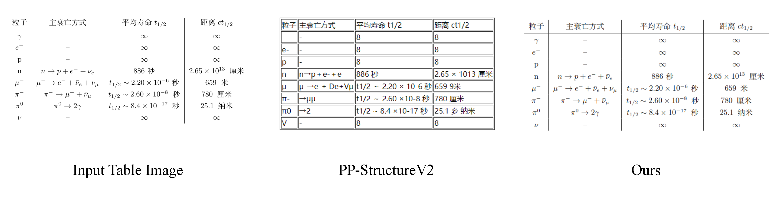

# Table Recognition
🔥🔥🔥 [MinerU: Efficient Document Content Extraction Tool Based on PDF-Extract-Kit](https://github.com/opendatalab/MinerU)

🔥🔥🔥 [StructEqTable: A High-efficiency Open-source Toolkit for Table-to-Latex Transformation](https://github.com/UniModal4Reasoning/StructEqTable-Deploy/)

We use [StructEqTable](https://github.com/UniModal4Reasoning/StructEqTable-Deploy) for table recognition, which is a very powerful end-to-end table recognition model. Currently it applies mainly to tables in **academic papers**. In the future, we will also expand more domains to improve the generalization ability of the model.

Here is a simple example where you can convert a given **table image to LaTeX** using the **StructEqTable** model, and then convert it to markdown or html using the convert_text function from 'pypandoc'. **Note** that the markdown format does not support merging cells, so there are cases where the LaTeX format is correct, but the markdown format does not merge cells. 

In addition, the current version of the model **supports both Chinese and English**, and in a week we will support the model with faster inference speed.


See [MinerU](https://github.com/opendatalab/MinerU) for the final end-to-end solution, which will integrate the table recognition within a week.

## Model Download
The weights file for StructEqTable can be downloaded from [modelscope](https://www.modelscope.cn/models/wanderkid/PDF-Extract-Kit/files) and [huggingface](https://huggingface.co/wanderkid/PDF-Extract-Kit/tree/main/models/TabRec/StructEqTable)

Put model files here:

```
/project dir
├── Layout
│   ├── config.json
│   └── model_final.pth
├── MFD
│   └── weights.pt
├── MFR
│   └── UniMERNet
│       ├── config.json
│       ├── preprocessor_config.json
│       ├── pytorch_model.bin
│       ├── README.md
│       ├── tokenizer_config.json
│       └── tokenizer.json
├── TabRec
│   └── StructEqTable
│       ├── config.json
│       ├──generation_config.json
│       ├──model.safetensors
│       ├──preprocessor_config.json
│       ├──special_tokens_map.json
│       ├──spiece.model
│       ├──tokenizer_config.json
│       └──tokenizer.json
└── README.md
```


## Installation
Make sure you have installed the PDF-Extract-Kit requirements in advance. It should be noted that for table recognition, **8GB** GPU memory is required for simple tables (less than 10 rows and 10 columns), and **24GB** GPU memory is required for complicated tables.

``` bash 
pip install struct-eqtable==0.1.0
pip install pypandoc
apt install pandoc
```


## Quick Demo
Please refer [here](./Table_Recognition.ipynb) for a simple experiment. 


## Visualization Results



## Citation
If you find our models / code / papers useful in your research, please consider giving ⭐ and citations 📝, thx :)
```bibtex
@article{xia2024docgenome,
  title={DocGenome: An Open Large-scale Scientific Document Benchmark for Training and Testing Multi-modal Large Language Models},
  author={Xia, Renqiu and Mao, Song and Yan, Xiangchao and Zhou, Hongbin and Zhang, Bo and Peng, Haoyang and Pi, Jiahao and Fu, Daocheng and Wu, Wenjie and Ye, Hancheng and others},
  journal={arXiv preprint arXiv:2406.11633},
  year={2024}
}

@misc{wang2024unimernet,
      title={UniMERNet: A Universal Network for Real-World Mathematical Expression Recognition}, 
      author={Bin Wang and Zhuangcheng Gu and Chao Xu and Bo Zhang and Botian Shi and Conghui He},
      year={2024},
      eprint={2404.15254},
      archivePrefix={arXiv},
      primaryClass={cs.CV}
}

@article{he2024opendatalab,
  title={Opendatalab: Empowering general artificial intelligence with open datasets},
  author={He, Conghui and Li, Wei and Jin, Zhenjiang and Xu, Chao and Wang, Bin and Lin, Dahua},
  journal={arXiv preprint arXiv:2407.13773},
  year={2024}
}

```