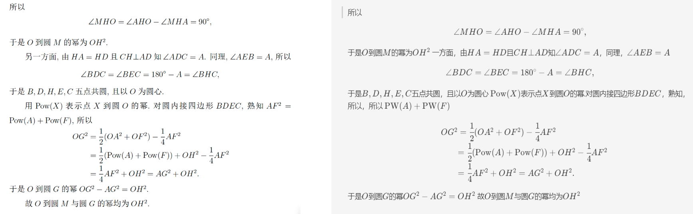

# PDF2Markdown

**Demo:(left: input image; right: rendered markdown.)**




1. Extract PDF features by these tasks:

    - Layout Detection: Using the YOLOv8 model for region detection, such as images, tables, titles, text, etc.;

    - Formula Detection: Using YOLOv8 for detecting formulas, including inline formulas and isolated formulas;

    - Formula Recognition: Using UniMERNet for formula recognition;

    - Table Recognition: Using StructEqTable for table recognition;

    - Optical Character Recognition: Using PaddleOCR for text recognition;

2. Convert features to markdown file:

    Using simple rules to convert the identified result to markdown (*Note: this is a simply convert code and can only support one-column PDFs, see [MinerU](https://github.com/opendatalab/MinerU) for more complex situation*).


# Usage

```
python project/pdf2markdown/scripts/run_project.py --config project/pdf2markdown/configs/pdf2markdown.yaml
```
